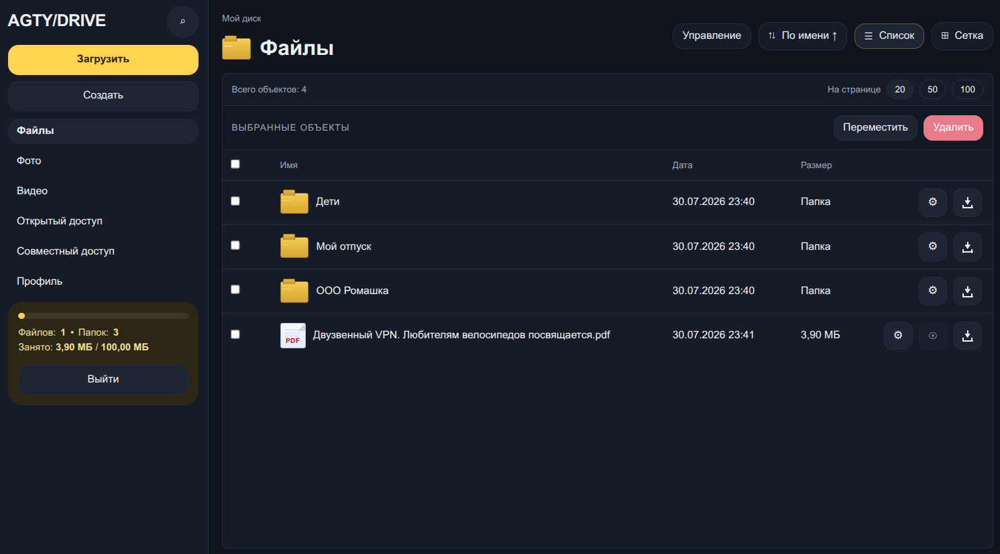

# AGTY/DRIVE



AGTY/DRIVE - это self-hosted web-сервис для хранения, просмотра и обмена файлами. По сценарию использования он близок к Яндекс Диску и Google Drive: файлы загружаются через браузер, раскладываются по папкам, открываются в режиме списка или сетки, получают предпросмотр и при необходимости публикуются по ссылке. Разница в том, что AGTY/DRIVE разворачивается на вашем сервере и остается под вашим контролем.

Ориентиры продукта совпадают с тем, как официально позиционируются крупные облачные диски: надежное хранилище файлов, доступ из браузера, предпросмотр, обмен ссылками и работа с медиа. В AGTY/DRIVE эти сценарии реализованы в приватной корпоративной или личной установке без зависимости от внешнего облака.

## Что умеет система

- личное файловое пространство с виртуальными папками;
- режимы `Список` и `Сетка`;
- загрузка файлов через форму, drag-and-drop и вставку из буфера `Ctrl+V`;
- массовая загрузка файлов с очередью и статусами;
- запрос на перезапись файла при совпадении имени;
- предпросмотр изображений, видео, аудио и текстовых файлов;
- отдельные библиотеки фото, видео и открытых ссылок;
- скачивание файлов и скачивание папок архивом;
- создание публичных ссылок на файлы и папки;
- пароль и срок действия публичной ссылки;
- WebDAV-доступ к выбранным папкам с отдельными логином и паролем;
- время жизни файла или директории с автоматическим удалением;
- удаление связанных публичных ссылок и общего доступа после истечения срока;
- регистрация по приглашениям и административное управление пользователями;
- светлая и темная темы интерфейса;
- хранение метаданных в PostgreSQL и бинарных файлов в файловой системе сервера.

## Для кого подходит

AGTY/DRIVE подходит для:

- небольших команд, которым нужен свой файловый сервис без внешнего SaaS;
- закрытых контуров, где файлы нельзя выносить во внешнее облако;
- внутренних порталов и сервисов обмена файлами;
- временной передачи файлов по ссылке с автоматическим удалением.

## Ключевые сценарии

### Хранение файлов
Пользователь заходит в браузере, создает папки, загружает файлы и работает с ними без прямого доступа к серверу.

### Быстрый просмотр
Изображения, видео, аудио и текст можно открыть в модальном просмотре без отдельного скачивания.

### Безопасный обмен
Файл или папку можно открыть по публичной ссылке, ограничить паролем, сроком жизни и правами на просмотр или скачивание.

### WebDAV для папок
Для выбранной папки можно включить WebDAV, выдать отдельные учетные данные и подключать ее как сетевой ресурс из файлового менеджера или настольного WebDAV-клиента.

### Временная загрузка
Для файла или директории можно задать время жизни. После наступления указанной даты объект удаляется автоматически вместе с публичными ссылками и связанным совместным доступом.

## Отличия от публичных облаков

- данные и бинарные файлы хранятся на вашем сервере;
- вы сами управляете PostgreSQL, путями хранения, лимитами загрузки и сетевыми настройками;
- можно использовать внутри локальной сети;
- продукт ориентирован на controlled/self-hosted deployment, а не на массовый облачный маркетплейс.

## Технологии

- Java 21
- Spring Boot 4
- Spring Security
- Thymeleaf
- PostgreSQL
- Flyway
- Maven Wrapper

## Документация

- [docs/INSTALLATION.md](docs/INSTALLATION.md)
- [docs/NGINX.md](docs/NGINX.md)
- [docs/USER_MANUAL.md](docs/USER_MANUAL.md)
- [docs/WEBDAV.md](docs/WEBDAV.md)

## Автоматическая установка на сервер

В репозитории есть сценарий `install/install.sh`, который:

- проверяет Java 21;
- запрашивает параметры PostgreSQL и приложения;
- проверяет подключение к БД;
- скачивает `latest` release asset с GitHub;
- создает директории приложения;
- выгружает jar и `config.ini-sample`;
- генерирует рабочий `config.ini`;
- создает и включает `systemd` service.

Подробности и формат release assets описаны в [install/RELEASE_ASSETS.md](install/RELEASE_ASSETS.md).

## Пошаговая установка

### 1. Установить Java и базовые shell-команды

Минимально поддерживаемая версия Java: `21`. Можно установить любую версию Java `>= 21`.

Пример для Ubuntu:

```bash
sudo apt update
sudo apt install -y openjdk-21-jre curl bash coreutils sed grep gawk
java -version
```

Если хотите собирать проект на сервере, вместо `openjdk-21-jre` можно поставить `openjdk-21-jdk`.

### 2. Подготовить PostgreSQL

Рекомендуемый вариант для быстрого старта: PostgreSQL в Docker.

Подробная инструкция вынесена в отдельный документ:

- [docs/DOCKER_POSTGRESQL.md](docs/DOCKER_POSTGRESQL.md)

В этом документе описано:

- как установить Docker;
- как запустить PostgreSQL в контейнере;
- как проверить подключение;
- какие значения потом вводить в `install.sh`.

### 3. Скачать `install.sh` и запустить его через `sudo`

Вариант с явным скачиванием файла:

```bash
mkdir -p ~/agtydrive-install
cd ~/agtydrive-install
curl -fsSL -o install.sh https://raw.githubusercontent.com/agtymc/org.agty.drive/master/install/install.sh
chmod +x install.sh
sudo ./install.sh
```

Во время установки скрипт задаст вопросы:

Сначала скрипт выведет служебные сообщения, например:

```text
Java check passed: openjdk version "25.0.3" 2026-04-21
Installer will create application directories, download latest release assets, generate config.ini and register a systemd service.
```

Затем он последовательно запросит параметры установки:

- `Install directory`
  Путь установки приложения, например `/opt/org.agty.drive`.
- `System user for service`
  Системный пользователь, от имени которого будет работать сервис, например `agarty`.
- `PostgreSQL host`
  Адрес PostgreSQL, например `localhost` или `127.0.0.1`.
- `PostgreSQL port`
  Порт PostgreSQL, обычно `5432`.
- `PostgreSQL database`
  Имя базы данных, например `agtydrive`.
- `PostgreSQL schema`
  Имя схемы PostgreSQL, обычно `public`.
- `PostgreSQL user`
  Пользователь PostgreSQL, под которым приложение будет подключаться к базе.
- `PostgreSQL password`
  Пароль этого пользователя PostgreSQL.
- `Application bind IP`
  Адрес, на котором будет слушать приложение. Если указать `0.0.0.0`, приложение будет доступно на всех сетевых интерфейсах.
- `Application bind port`
  Порт приложения, например `8080` или `8090`.
- `Application title`
  Заголовок приложения, который будет показан в интерфейсе, например название вашей организации.
- `Application subtitle/about`
  Подзаголовок или текст на экране входа.
- `Public application URI`
  Публичный адрес приложения, например `https://drive.example.com`.
- `Application timezone`
  Часовой пояс приложения, например `Europe/Moscow`.
- `Content storage directory`
  Директория на сервере, где будут храниться загруженные файлы, например `/opt/org.agty.drive/content`.
- `Max single file upload size`
  Максимальный размер одного файла, например `1024MB`.
- `Max request upload size`
  Максимальный общий размер файлов в одном запросе.

После ввода параметров скрипт покажет технические этапы выполнения, например:

```text
Checking PostgreSQL connection...
PostgreSQL connection check passed.
Requesting latest GitHub release metadata...
Creating directories...
Downloading jar asset...
Downloading config sample asset...
Downloading maintenance scripts...
Generating config.ini...
Generating launch script...
Generating systemd service...
Fixing ownership...
Reloading and enabling service...
Created symlink /etc/systemd/system/multi-user.target.wants/org.agty.drive.service → /etc/systemd/system/org.agty.drive.service.
```

После завершения установки скрипт выведет итоговую информацию: введенные параметры, пути к файлам и директориям, а также служебные команды для дальнейшей работы:

```text
Installation complete.
Application directory: /opt/org.agty.drive
Launch script: /opt/org.agty.drive/org.agty.drive.sh
Service: org.agty.drive.service
Config: /opt/org.agty.drive/config.ini
Sample config: /opt/org.agty.drive/config.ini-sample
Logs: /opt/org.agty.drive/logs
Maintenance scripts: /opt/org.agty.drive/install
```

Перед переходом к работе обязательно дождитесь запуска сервиса:

```text
Wait about 30 seconds for the service to finish starting.

Connection details:
URL: http://127.0.0.1:8090
Login: admin
Password: admin
Note: on a non-first installation with an existing database, use the login and password already stored in the database.
```

Для управления сервисом используйте следующие команды:

```
Useful commands:
sudo systemctl status org.agty.drive.service
sudo systemctl start org.agty.drive.service
sudo systemctl stop org.agty.drive.service
sudo systemctl restart org.agty.drive.service
sudo journalctl -u org.agty.drive.service -f
```

Если нужно обновить сервис или удалить используйте следующие команды:

```
sudo bash /opt/org.agty.drive/install/update.sh
sudo bash /opt/org.agty.drive/install/uninstall.sh
```

### 4. Однострочная команда: скачать и сразу запустить install

Если не хотите сохранять скрипт вручную:

```bash
curl -fsSL https://raw.githubusercontent.com/agtymc/org.agty.drive/master/install/install.sh -o /tmp/agtydrive-install.sh && chmod +x /tmp/agtydrive-install.sh && sudo /tmp/agtydrive-install.sh
```

После завершения установки скрипт:

- скачает `latest` release;
- создаст `config.ini`;
- зарегистрирует `systemd` service;
- запустит приложение.

## Публикация через Nginx

При работе через Nginx отключите буферизацию тела запроса, иначе Nginx сначала полностью сохранит загружаемый файл во временную директорию и только затем передаст его приложению. Для больших файлов это выглядит как длительная пауза на `95%`.

Добавьте в проксирующий `location`:

```nginx
proxy_http_version 1.1;
proxy_request_buffering off;
proxy_pass http://127.0.0.1:8091;
```

Полный пример с HTTPS, лимитами и командами проверки приведен в [docs/NGINX.md](docs/NGINX.md).

## Как работает update

Для обновления установленного сервиса используйте:

```bash
sudo bash /opt/org.agty.drive/install/update.sh
```

Во время обновления скрипт:

- скачивает новый jar из `latest` release;
- обновляет `config.ini-sample`;
- обновляет служебные скрипты `update.sh` и `uninstall.sh`;
- перезапускает `systemd` service.

### Как update работает с конфигом

`update.sh` не перезаписывает рабочий `config.ini` автоматически.

Вместо этого он работает так:

- сохраняет текущий `config.ini` без изменений;
- скачивает новый `config.ini-sample`;
- создает `config.ini.merged`
  это версия нового sample, в которую автоматически подставлены текущие значения для совпадающих ключей;
- создает `config.deprecated-keys.txt`
  туда попадают ключи, которые есть в текущем `config.ini`, но отсутствуют в новом sample.

Если `config.ini.merged` отличается от текущего `config.ini`, скрипт явно сообщает об этом и спрашивает, нужно ли заменить рабочий конфиг.

Если вы подтверждаете замену:

- создается backup-файл вида `config.ini.bak.YYYYMMDD-HHMMSS`;
- текущий `config.ini` заменяется на `config.ini.merged`.

Если вы отказываетесь:

- текущий `config.ini` остается без изменений;
- `config.ini.merged` остается рядом для ручной проверки.

`config.deprecated-keys.txt` особенно важен при обновлении:

- он показывает ключи, которых больше нет в новом sample;
- это может означать, что параметр был удален;
- это может означать, что параметр был переименован и его нужно вручную перенести в новый ключ.

## Дополнительная документация

- [docs/DOCKER_POSTGRESQL.md](docs/DOCKER_POSTGRESQL.md) - установка Docker и PostgreSQL для AGTY/DRIVE
- [docs/NGINX.md](docs/NGINX.md) - настройка Nginx и потоковой загрузки больших файлов
- [docs/MAVEN.md](docs/MAVEN.md) - запуск, сборка и тестирование проекта через Maven Wrapper
- [docs/USER_MANUAL.md](docs/USER_MANUAL.md) - руководство пользователя

## Публикация release на GitHub

Для корректной работы инсталлятора в `latest` release должны лежать:

- jar-файл приложения;
- `config.ini-sample`.

Инструкция по именованию и размещению файлов находится в [install/RELEASE_ASSETS.md](install/RELEASE_ASSETS.md).

## Лицензия

Проект распространяется под лицензией Apache License 2.0. См. [LICENSE](LICENSE) и [NOTICE](NOTICE).
